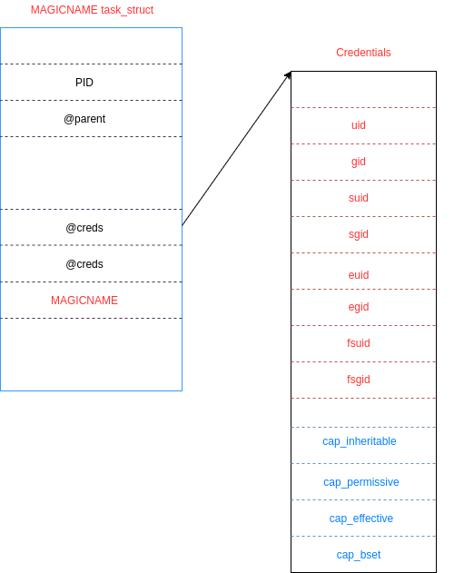
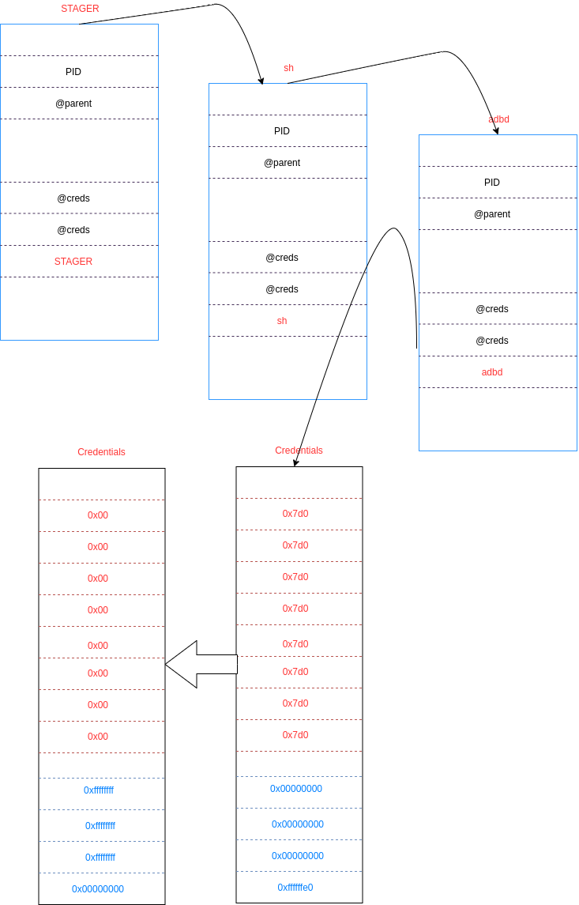

---
Detailed usage
---

To have an idea about the different options that Android_Emuroot accepts, you can run it using the option `--help`:

```
python3 android_emuroot.py --help 
usage: android_emuroot.py [-h] [-v] [-V] [-t TIMEOUT] [-d DEVICE]
                          {single,adbd,setuid} ...

Usage:

optional arguments:
  -h, --help            show this help message and exit
  -v, --version         show program's version number and exit
  -V, --verbose         increases verbosity
  -t TIMEOUT, --timeout TIMEOUT
                        set the GDB timeout value
  -d DEVICE, --device DEVICE
                        specify the emulator name

modes:
  {single,adbd,setuid}
    single              elevates privileges of a given process
    adbd                elevates adbd privileges
    setuid              creates a setuid shell launcher
```

Android_Emuroot offers three ways (modes) to get an elevated access to Android emulator. 
The idea is that you can choose one of the three modes depending on your RE needs and constraints. 

# Single mode

The single mode consists in launching a shell (/bin/sh) process under a different specific name (unique name). 
This latter is searched into the emulator memory using GDB. As stated in the README, his new given process name 
is used to look for the task_struct structure in the emulator memory. This structure holds the process metadata 
that will be modified to elevate it.

The figure (task_struct) shows the fields that are modified by Android_Emuroot. 




The single mode requires a magicname as parameter. That corresponds to the name you gave to the shell you want to root.
```
usage: android_emuroot.py single [-h] --magic-name MAGIC_NAME

optional arguments:
  -h, --help            show this help message and exit
  --magic-name MAGIC_NAME
                        name of the process, that will be looked for in memory

```

Hence, you can for example create a symbolic link to /bin/sh in your emulator:
```
Android/Sdk/platform-tools$./adb devices 
List of devices attached
emulator-5554   device

Android/Sdk/platform-tools$ ./adb shell 

generic_x86:/ $ cd /data/local/tmp 

generic_x86:/data/local/tmp $ ln -s /system/bin/sh MAGICNAME 
generic_x86:/data/local/tmp $ ls -ali
total 8
65538 drwxrwx--x 2 shell shell 4096 2020-03-24 14:17 .
65537 drwxr-x--x 3 root  root  4096 2020-03-23 18:23 ..
65539 lrwxrwxrwx 1 shell shell   14 2020-03-24 14:17 MAGICNAME -> /system/bin/sh

generic_x86:/data/local/tmp $ ./MAGICNAME                                                                                                                           
generic_x86:/data/local/tmp $ ps 
USER           PID  PPID     VSZ    RSS WCHAN            ADDR S NAME                       
shell         4312  2119    5752   3004 sigsuspend   b4a7cac4 S sh
shell         4347  4312    5752   2656 sigsuspend   a79ccac4 S MAGICNAME
shell         4348  4347    7320   3260 0            b143eac4 R ps

```
Once, there is a process with the your given string, you can launch Android_Emuroot:

```
python3 android_emuroot.py -t 180 -VVVVV -d emulator-5554 single --magic-name MAGICNAME

2020-03-24 14:47:57 INFO:  kernel_version() : result is 3.18.91+

2020-03-24 14:47:57 INFO: [+] Entering single function process name is MAGICNAME 
2020-03-24 14:47:57 INFO: [+] Check if MAGICNAME is running 
2020-03-24 14:47:57 INFO: [+] OK. MAGICNAME is running
2020-03-24 14:47:57 INFO:  [+] Start the GDB controller and attach it to the remote target
2020-03-24 14:47:57 INFO:  [+] GDB additional timeout value is 180
...
2020-03-24 14:51:17 INFO:  [+] Detach and stop GDB controller


```
Now, you can go back to your emulator and check for your process owner:

```
generic_x86:/data/local/tmp $ ps
USER           PID  PPID     VSZ    RSS WCHAN            ADDR S NAME                       
shell         5183  2119    5752   3024 sigsuspend   acb17ac4 S sh
root          5193  5183    5752   2996 sigsuspend   b6618ac4 S MAGICNAME
root          5616  5193    7320   3232 0            ab8edac4 R ps

generic_x86:/data/local/tmp $ id
uid=0(root) gid=0(root) groups=0(root),1004(input),1007(log),1011(adb),1015(sdcard_rw),1028(sdcard_r),3001(net_bt_admin),3002(net_bt),3003(inet),3006(net_bw_stats),3009(readproc),3011(uhid) context=u:r:shell:s0

```
Single mode is not a persistent technique, so each time you exit the shell you rooted, you have to execute again Android_Emuroot. 
As you can guess, launching multiple times Android_Emuroot may not work because of the incoherence of the emulator memory. To resolve that, simply reboot the emulator in a cold boot mode.


# Adbd mode 
For adbd mode, instead of patching a given process the adbd process task_struct itself that is modified.
For that, it is not required to specify a process name as an argument to Android_Emuroot. Even though, the same technique as for single mode is used here. All the following steps are automated by the script:
* Creating a symbolic link to /bin/sh with a MAGICNAME
* Launching the shell 
* Searching MAGICNAME task_struct in emulator kernel memory
* Stepping through parent task_struct PID until finding adbd structure
* Modifying Cred strucuture of adbd process 
* Setting SELinux mode to permissive
  



```

python3 android_emuroot.py adbd --help
usage: android_emuroot.py adbd [-h] [--stealth]

optional arguments:
  -h, --help  show this help message and exit
  --stealth   try to make it less obvious that adbd has new privileges

```

You can execute Android_Emuroot as below without opening a shell on the emulator. Once the script ends its operations, you can get a shell with `adb shell` which will have root privileges.

```
python3 android_emuroot.py -t 180 -VVVVV -d emulator-5554 adbd 
2020-03-25 16:53:44 INFO:  kernel_version() : result is 3.18.91+

2020-03-25 16:53:44 INFO: adbd mode is chosen
2020-03-25 16:53:44 INFO: [+] Rooting with Android Emuroot via adbd...
2020-03-25 16:53:44 INFO: [+] Launch the stager process
2020-03-25 16:53:49 INFO: [+] OK. STAGER is running
2020-03-25 16:53:49 INFO:  [+] Start the GDB controller and attach it to the remote target
2020-03-25 16:53:49 INFO:  [+] GDB additional timeout value is 180
2020-03-25 16:53:50 INFO:  [+] GDB server reached. Continue
2020-03-25 16:53:50 INFO:  [+] Get address aligned whose process name is: [STAGER]
2020-03-25 16:53:50 INFO:  [+] This step can take a while (GDB timeout: 180sec). Please wait...
2020-03-25 16:56:52 INFO: [+] Search adbd task struct in the process hierarchy
...
2020-03-25 16:57:27 INFO: [+] Clean the stager process
```

You can check for the privileges you're given. 

```
./adb shell
generic_x86:/ # id
uid=0(root) gid=0(root) groups=0(root),1004(input),1007(log),1011(adb),1015(sdcard_rw),1028(sdcard_r),3001(net_bt_admin),3002(net_bt),3003(inet),3006(net_bw_stats),3009(readproc),3011(uhid) context=u:r:shell:s0

```


# Setuid mode

 
 TODO

