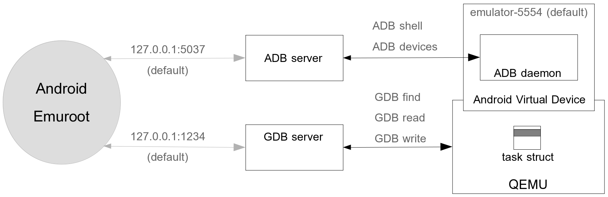

# Android_Emuroot

## Introduction

Android_Emuroot is a Python script that allows to **grant root privileges** to
*Google API Playstore* emulator shells on the fly to help Reverse Engineers to
go deeper into their investigations.

Android_Emuroot technique is based on the ability of *Google API Playstore*
emulator to be launched with the qemu gdb stub option enabled and the control
of process metadata stored in memory in kernel task structures. The main idea
is to start from a shell with the lowest privileges, then to find its
associated credential structure in kernel memory to replace it by another
structure having the highest privileges.

Implementing this memory modification on a *Google API Playstore* emulator presents the
two following advantages:
* to work with an environment very similar to a physical device (with production 
  built number, etc.) and with all Google Play and Google services packages 
  already installed; It is often required by the targeted applications to work fine;
* to have a very easily modifiable memory since a GDB debugger can be attached to 
  the device to fully control the kernel memory.

## Requirements

### Prerequisites

Android_Emuroot requires to already have a working [Android
SDK](https://developer.android.com/studio). Installing the [command-line
tools](https://developer.android.com/studio#command-tools) is recommended
(downloadable via the Android Studio GUI: Tools > Android > SDK manager > SDK
Tools).

### Installing dependencies

Android_Emuroot is a Python script that uses the ADB facilities as well as the
GDB facilities from the two following Python's modules:

* [pygdbmi](https://pypi.org/project/pygdbmi) (Parse GDB machine interface output with Python)
* [pure-python-adb](https://pypi.org/project/pure-python-adb) (Pure Python implementation of the ADB client)

**Be sure you have these modules or install them via pip:** `pip install -r requirements.txt`.

### Supported *Google API Playstore* emulators

Depending on the hardware architecture and the kernel version of the emulator,
the memory layout of the related qemu image varies. Thereby the location of
the memory patches implemented by Android_Emuroot varies as well. 

For now, Android_Emuroot supports the following versions of emulators:

| Android version | API | Architecture | Kernel | Build                |
| --------------- | --- | ------------ | ------ | -------------------- |
| Android 7.0     | 24  | x86          | 3.10   | google-api-playstore |
| Android 7.1.1   | 25  | x86          | 3.10   | google-api-playstore |
| Android 8.0     | 26  | x86          | 3.18   | google-api-playstore |
| Android 8.1     | 27  | x86          | 3.18   | google-api-playstore |


**Be sure the AVD you want to root is based on one emulator of this list.**

N.B.: the emulators can be downloaded via
[sdkmanager](https://developer.android.com/studio/command-line/sdkmanager), a
tool from the Android Studio toolchain, with the GUI or in command line, for
example like this: ```sdkmanager --install "system-images;android-27;google_apis_playstore;x86"```. 
Then, create an Android Virtual Device (AVD) accordingly, via the AVD manager GUI or
with
[avdmanager](https://developer.android.com/studio/command-line/avdmanager)
like this: `/avdmanager create avd -n my_avd_name -k system-images;android-27;google_apis_playstore;x86"`.


### Working environment

To work well, Android_Emuroot communicates with:

* the ADB server of to get information from the emulated device and spawn shells inside
* the GDB server of QEMU to get information about the memory layout of the emulated device and patch values in memory.

The scheme below shows the interaction between all the elements:



#### Launching the ADB server

The Android Debug Bridge
([ADB](https://developer.android.com/studio/command-line/adb)) is a another
command line tool of the Android Studio toolchain that lets communicate with
an Android device. The ADB server is the component that manages communication
between Android_Emuroot and the ADB daemon launched on the device. By default,
ADB servers listen on *127.0.0.1* port *5037*.  `adb start-server` lets you
ensure that there is a server running.

**Be sure your ADB server is running.**


#### Making the GDB server available

The other key point to use Android_Emuroot is to  attach a GDB server to your
AVD when launching it.
[emulator](https://developer.android.com/studio/run/emulator-commandline),
another command line tool of the Android Studio toolchain, allows to launch
AVDs with a lot of options. Among them: `-qemu -s` (shorthang for `-qemu -gdb tcp::1234`) 
 which opens a GDB server on TCP port 1234. 

**Use it to get a GDB server available.**

Here is an simple example of [emulator](https://developer.android.com/studio/run/emulator-commandline)'s usage:

```emulator -avd my_avd_name [options] -qemu -s```

This way, a GDB server will be attached to the AVD `my_avd_name` and
Android_Emuroot will be able to spawn its GDB client and perform the memory
patches.

**With all these requirements, you are ready to use Android_Emuroot.**

## Usage

### Features 

Android_Emuroot has 3 modes:

* `single --magic-name NAME`:  to give root privileges to only 1 shell given in parameter
* `adbd [--stealth]`:  to give root privileges to the entire `adbd` server; each new shell will be spawned as root
* `setuid --path NAME`:  to install a setuid root binary on the file system


TODO


## About

### Authors

Android_Emuroot has been written by Mouad Abouhali and Anaïs Gantet from
[airbus-seclab](https://airbus-seclab.github.io).


### License

Android_Emuroot is released under
[GPLv2](https://github.com/airbus-seclab/android_emuroot/blob/master/LICENSE.md).